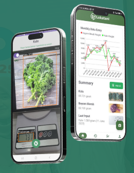
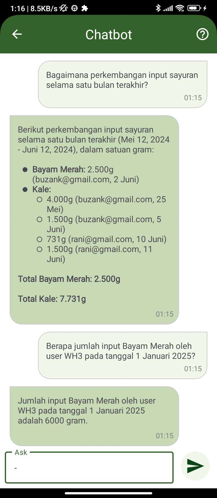
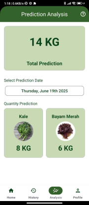
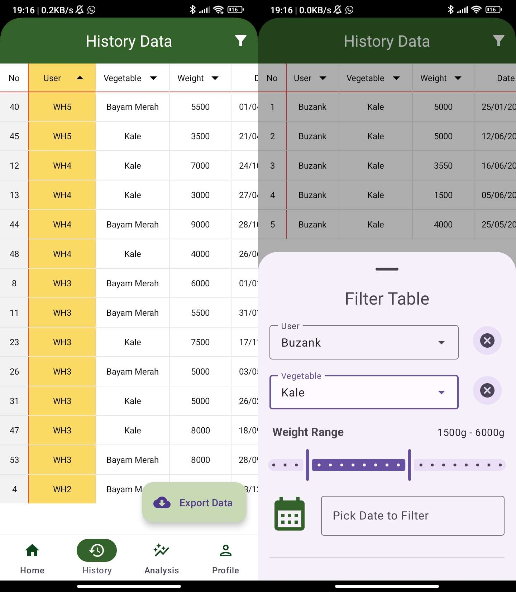

# LokaFresh Inventory

## Team Members
| Member                                                    | Role               | University                |
|-----------------------------------------------------------|--------------------|---------------------------|
| [Salma Kamila](https://github.com/salmaakmll)             | Project Manager    | Politeknik Negeri Jakarta |
| [Muhammad Rizky Ramadhani](https://github.com/BuzanKun)   | Mobile Development | Politeknik Negeri Jakarta |
| [Chairania Jasmine Bambang](https://github.com/Chairania) | UI/UX Designer     | Politeknik Negeri Jakarta |
| [Muhammad Nur Irfan](https://github.com/Chifaaan)         | Machine Learning   | Politeknik Negeri Jakarta |

## About
LokaFresh Inventory is an android app solution for streamlining inventory management by using Object Detection AI Model to detect vegetable types in real-time and the weight displayed on a weight scale.

## Main Features in LokaFresh Inventory

### Object Detection

The main feature of the app, capable of detecting vegetables type real-time by using Object Detection alongside OCR to read the weight measured on the weight scale.

- Developed YOLO Object Detection to detect vegetable types and weight scale
- Implemented the YOLO Model on-device for real-time detection
- Using pre-trained PaddleOCR Model to read the number on weight scale
- Store the detected result to Firestore

### Chatbot

The second feature of the app, covering the use of Natural Language Processing in the form of LLM Chatbot to answer user's question about the inventory data.

- Using Gemini API as the base LLM model for the chatbot
- Using the data stored in the Firestore as the base knowledge for the LLM

### Prediction Analysis

## Additional Feature

### TableView Data Display

Display the stored data in Tableview manner using [Evrencoskun's TableView Library](https://github.com/evrencoskun/TableView).

- User can also filter the data as they wanted using the filter function
- The end-result of the table data can be exported in csv format